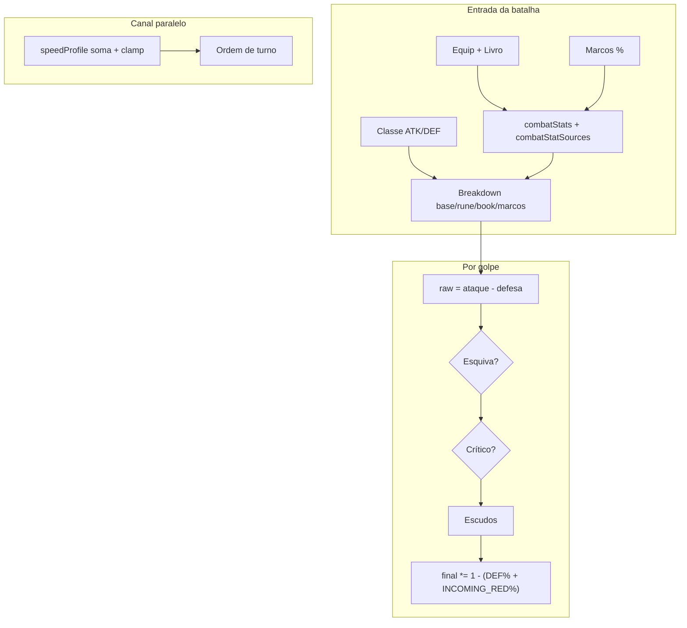

# Padrão de buffs, stats e soma — Batalha v1

Documento para alinhar **quais números existem**, **como somam hoje** e **proposta de padrão** (visualização + regras).

---

## 1. Inventário completo (o que entra na lógica)

### 1.1 Seis stats de equipamento / livro (UI e `ItemBuffType`)

| Rótulo UI | Tipo interno | Vai para (combate) |
|-----------|--------------|-------------------|
| **Força** | `Strength` | `attackPercent` (+ `attackBookPercent` se livro) |
| **Defesa** | `Defense` | `defensePercent` (+ `defenseArmorPercent` se peça de armadura) |
| **Crítico** | `Critical` | `critChanceBonus` (valor do item ÷ 100 → chance 0–1) |
| **Velocidade** | `Agility` | `equipSpeedFlat` (iniciativa) + mapa (`agilidade` do SET) |
| **Esquiva** | `Dodge` | `dodgePercent` |
| **Vida** | `Hp` | `maxHpBonusPercent` (fora do golpe por turno) |

Fonte: `combatLoadoutResolver.applyBuffModifiers`, espelho UI em `PLAYER_STATS_BONUS_LABELS`.

### 1.2 Quatro stats de classe (base fixa por `ClassType`)

| Stat | Uso hoje |
|------|----------|
| **Ataque** (`CLASS_CATALOG.*.attack`) | Linha `base` do breakdown ofensivo |
| **Defesa** (`CLASS_CATALOG.*.defense`) | Linha `base` do breakdown defensivo |
| **Velocidade** (classe) | `classSpeedBias` na iniciativa (+ viés por classe no balance) |
| **Controle** | **Ainda não entra na fórmula de dano** — reservado (CC, PP, etc.) |

### 1.3 Quatro rótulos de “estilo” do move (`MoveScalingStat`)

Só **rótulo / tooltip / estilo de personagem** — **não somam** como buff numérico no motor hoje:

- **Força (STR)**, **Velocidade (AGI)**, **Defesa (DEF)**, **Crítico (CRIT)** — rótulo único em `statDisplayLabels.ts`

### 1.4 `CombatantCombatStats` (passivos resolvidos na entrada da batalha)

| Campo | Significado | Soma na entrada |
|-------|-------------|-----------------|
| `attackPercent` | % sobre ATK de classe no breakdown | **Soma linear** (equip + marcos + livro) |
| `defensePercent` | % sobre DEF de classe | **Soma linear** |
| `critChanceBonus` | Chance 0–1 (ex.: 0.12 = 12%) | **Soma linear** |
| `critDamageBonus` | Aditivo ao mult. crítico (base 1.5) | **Soma linear** |
| `dodgePercent` | Chance 0–100 de esquivar golpe | **Soma linear** |
| `damageReductionPercent` | Redução % (marcos) | **Soma linear** → entra no breakdown defensivo (`marcoDamageReductionPercent`) |

### 1.5 Iniciativa / “velocidade de turno” (canal separado)

Não é o mesmo buff que “Força”. Componentes em `speedProfile` + `combat_balance_v1_2.json`:

| Componente | Origem |
|------------|--------|
| `flowSpeedBase` | Progressão / fluxo |
| `classSpeedBias` | Classe |
| `equipSpeedFlat` | Velocidade de equipamento (buff `Agility`) |
| `marcoSpeedFlat` | Marcos (`speed_flat`) |
| `buffSpeedFlat` | Buffs de batalha (skills) |
| `runeSpeedFlatConditional` | Runa `SPEED_NEXT_TURN` |
| Poção / exaustão | `potionSpeedBuff`, penalidade com redução `stableFlux` |

**Fórmula:** soma com **clamp global** (−20 … +40) e **caps por fonte** (equip 18, buff 14, runa 7).

Ordem de turno: `priority` do move → `effectiveSpeedRaw` → seed.

### 1.6 Runas (efeito de combate, além de buff passivo de slot)

| Tipo | Efeito |
|------|--------|
| `CRIT_BONUS` | Bônus crítico contextual (sessão aplica em regra) |
| `REFLECT_DMG` | Espelho / retaliação (metadata) |
| `SPEED_NEXT_TURN` | Flat condicional na iniciativa |

### 1.7 Marcos (15 nós — passivos + procs)

**Passivos (`MarcoCombatModifierKind`):**  
`speed_flat`, `crit_chance`, `crit_damage`, `defense_percent`, `dodge_percent`, `attack_percent`, `damage_reduction`, `exhaustion_reduction`

**Procs (ápice):** `beyond_time_steps`, `precision_master`, `invincible_bastion`

**Legado Ficha:** `attackMarcosFlat` / `defenseMarcosFlat` por domínio de trilha (soma no breakdown, separado dos % do catálogo novo).

### 1.8 Modificadores temporários de turno (`RuntimeModifierKind`)

| Kind | Efeito |
|------|--------|
| `ATTACK` | +% dano causado (soma entre instâncias) |
| `DEFENSE` | +% redução pós-cálculo (soma) |
| `INCOMING_DAMAGE_REDUCTION` | +% redução pós-cálculo (soma) |
| `HEAL` | +% cura recebida |
| `BUFF_WEAKEN` | −% eficácia (subtrai de ATK/HEAL) |

Implementação: `resolveModifierPercent` = **soma de todos os modificadores ativos do mesmo kind**.

### 1.9 Status (`activeStatuses`) — não são % de stat, são regras

Exemplos já ligados ao motor: `BURN`, `PARALYZE`, `CONFUSE`, `THORNS`, `STATUS_IMMUNITY`, `MARCO_CC_IMMUNE`, armadilhas/detonação, eco de cura, vulnerável (+20% dano), etc.

### 1.10 Escudos (`activeShields`)

Absorvem dano **depois** de `calculateDamage`, antes de HP.

### 1.11 Outros multiplicadores (não “buff de stat”)

- **HP elasticity** — dano tomado por faixa de HP  
- **Comportamento de monstro** — multiplicador contextual  
- **Esquiva** — roll único com `dodgePercent` total  
- **Crítico** — roll com `critChanceBonus` total; mult. `1.5 + critDamageBonus`  
- **Poção** — velocidade / exaustão / cura recebida (regras em balance)

---

## 2. Como a soma funciona HOJE (resumo técnico)

| Canal | Regra atual | Onde ver |
|-------|-------------|----------|
| Passivos ATK/DEF/CRIT/Dodge | Soma linear, sem cap global (exceto speed) | `combatLoadoutResolver` |
| Breakdown HUD | Soma das linhas | `combatBreakdownBuilder` |
| Modificadores de turno | Soma linear por `kind` | `CombatEngine.resolveModifierPercent` |
| Redução pós-dano | `DEFENSE` + `INCOMING_DAMAGE_REDUCTION` somados | `applyDirectDamage` |
| `damageReductionPercent` em `combatStats` | Entra na **defesa do breakdown**, não duplica no pós-% | `buildDefenseBreakdown` |
| Velocidade de turno | Soma + clamp + caps por fonte | `combat_balance_v1_2.json` |
| Velocidade no mapa | `agilidade * 2` % — exploração (mesmo stat AGI do SET) | `playerStatsBonus` |

---

## 3. Proposta de PADRÃO (para decidir em reunião)

### 3.1 Regra de ouro: camadas independentes

1. **Equipamento, runa e livro** somam **sempre**, cada um na sua linha (`attackArmorPercent`, `attackRunePercent`, `attackBookPercent`, `defenseBookPercent`, etc.) — **não dependem** de Marcos ativos.  
2. **Marcos** somam **por cima**, na mesma fórmula, só em `attackMarcosPercent` / `defenseMarcosPercent` / `marcoCritPercent` / flat de Ficha — com lista `activeMarcos` vazia, equip+runa+livro continuam iguais.  
3. **Buffs de skill / poção** (runtime): soma aditiva no mesmo `RuntimeModifierKind` ou status; chips no portrait.  
4. **Entre camadas**: breakdown por fonte → rolls (esquiva/crit) → escudo → redução pós-golpe. Sem fallback que joga tudo em “armadura”.

### 3.2 Caps recomendados (evitar explosão)

| Stat | Cap sugerido (MVP) | Notas |
|------|-------------------|--------|
| `critChanceBonus` | 35% (0.35) | Runas/skills podem dar picos pontuais |
| `critDamageBonus` | +0.50 (mult. máx. 2.0) | Base 1.5 |
| `dodgePercent` | 40% | Esquiva total no roll |
| `attackPercent` + fontes breakdown | 80% soma de linhas % | Ou cap por linha no balance |
| `defensePercent` + redução marcos | 60% na defesa + 30% pós-golpe **ou** fundir tudo num cap 50% pós | Hoje há dois “DEF%” (breakdown + runtime) |
| `speedBonusTotal` | Já existe: −20…+40 | Manter |
| Runtime `ATTACK` stacks | 3 stacks × valor do move | Já implícito em `AttackStack` |

### 3.3 Visualização recomendada

| Onde | O quê |
|------|--------|
| **Portrait (batalha)** | Chips: `ESC` escudo, `DEF` % temporário, `ESP` espinhos, `IMM`, `QUE` (burn/para), `ATK+` / `FRG` (weaken) |
| **Barra lateral pré-batalha** | Os 6 stats de equip + resumo marcos |
| **Popup de dano** | Breakdown: base, armadura, runa, livro, marcos (já existe) |
| **Turno** | Flash no portrait ao aplicar `SHIELD_APPLIED` / `STATUS_APPLIED` |
| **Nome único** | **Velocidade** em UI (`statDisplayLabels.ts`); chaves internas `Agility` / `agilidade` / `AGI` |

### 3.4 Decisões em aberto (precisam de OK do time)

- [ ] **A)** Manter `damageReduction` só no breakdown defensivo **ou** **B)** mover tudo para pós-% único com cap global?  
- [ ] **Crítico**: chance total visível no HUD (ex. “12%”) ou só no log ao procar?  
- [ ] **DEF runtime + DEF passivo**: somar no mesmo chip `DEF` ou dois chips (`DEF` / `RED`)?  
- [ ] **Controle de classe**: quando entra (reduzir chance de paralisar, drenar PP)?  
- [ ] **ScalingStat (STR/AGI/DEF/CRIT)**: continuar só estética ou passar a dar +5% no stat correspondente por ponto futuro?

---

## 4. Mapa rápido: “buff que o jogador vê” → motor

| Jogador diz | Motor |
|-------------|--------|
| Força | `attackPercent` / breakdown armadura |
| Defesa | `defensePercent` / `DEFENSE` modifier / breakdown |
| Crítico | `critChanceBonus` + `critDamageBonus` |
| Velocidade (turno) | `speedProfile` → iniciativa |
| Esquiva | `dodgePercent` |
| Vida | `maxHpBonusPercent` |
| Escudo | `activeShields` |
| Buff de skill | `temporaryModifiers` + statuses |

---

## 5. Próximo passo de implementação (após OK)

1. Aplicar caps no `resolveCombatLoadout` ou no `CombatEngine` conforme tabela §3.2.  
2. Unificar redução % (item A/B).  
3. Estender `battlePortraitOverlay` com chips `ATK`, `VEL`, `CRIT` opcionais.  
4. Expor totais no snapshot (`combatStatsSummary`) para HUD espelhar servidor.

---

*Versão: 1.0 — alinhado ao código em `combatLoadoutResolver`, `BattleEngine.calculateDamage`, `CombatEngine`, `marcoCombatEffectCatalog`.*
